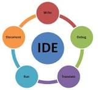

# what is IDE ?

**Main components of an IDE**

1. Code Editor
   Where you write your program (with features like syntax highlighting and auto-complete).
2. Compiler or Interpreter
   Converts your code into a form the computer can understand.
3. Debugger
   Helps find and fix errors (bugs) in your code.
4. Build Automation Tools
   Helps run and manage your project efficiently.

# Popular IDEs

**examples**

1. Visual Studio Code
2. IntelliJ IDEA
3. Eclipse
4. PyCharm

