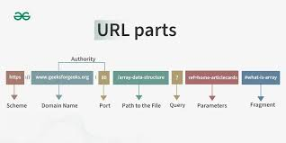

# what is URL ?

1. where to find something
   (website,image,file,etc.)
2. how to access it.
   ** parts of URL **
3. protocol (scheme)
   1.it tells the browser how to communicate with the server.
4. common types
   1.domain name
   2.it is the name of the website.
5. path
   1.it shows the specific page or resource .
6. query parameters
   1.it sends extra information.
   **URL definition**
   -A URL is a complete web adress used to locate a page or resource on the internet.
   **URL like**
7. protocl=mode of transport (car,train)
8. domain=city name
9. path=street and house number

