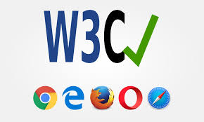

# what is w3c ?

1. w3c stands for world wide web consortium.

**W3c**

1. websites work on all browsers (chrome,firefox,etc.)
2. web technologies are compatible and standardized.
3. the web is accessible to everyone including pepole with disabilities.
4. HTML (structure of web pages)
5. CSS (styling of web pages)
6. XML (data storage and transport)

# examples

1. a website might work in one browser but not in another.

