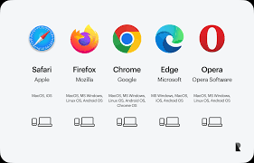

# what is web browser?

1. you type a website address URL in the browser.
2. the browser sends a request to a web server.
3. the serever sends back webpage data (HTML,CSS,ETC.)
4. the browser diplays the webpage on your screen.

**line of beowsers**

1. it is the main tool to use the internet.
2. helps users easily access information.
3. makes websites interactive and users friendly.

# examples

1. google chrome
2. mozila firefox
3. microsoft edge
4. safari

